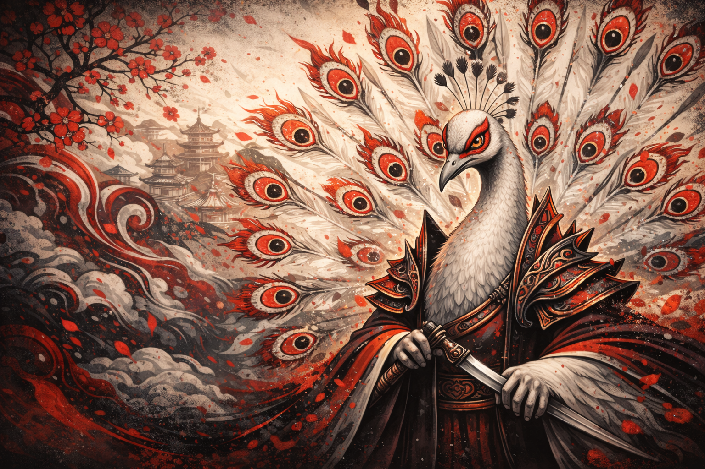

<!-- ===== HERO / BACKGROUND (banner) ===== -->

  <!-- TIP: sube un banner a tu repo (assets/banner.png) y usa ese link -->
  

<!-- Personajes a los lados (opcional) -->

  
  
  

<h1 align="center">Stiven Kno</h1>

  
  
  

<!-- Separador aesthetic (puede ser una imagen wave) -->

  

<!-- ===== HIGHLIGHTS (casi sin texto) ===== -->

  
  
  
  
  

<!-- ===== ICON WALL (lo que más resalta) ===== -->

  

<!-- ===== MINI PORTFOLIO (solo tarjetas con imagen) ===== -->

  
  
  

<!-- Footer aesthetic -->

  

